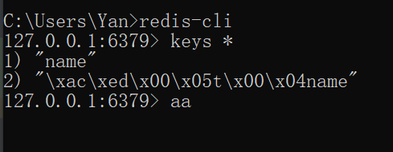
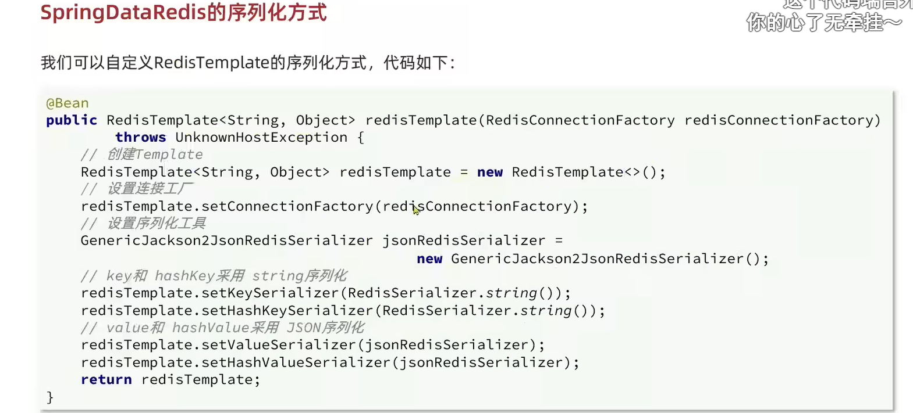
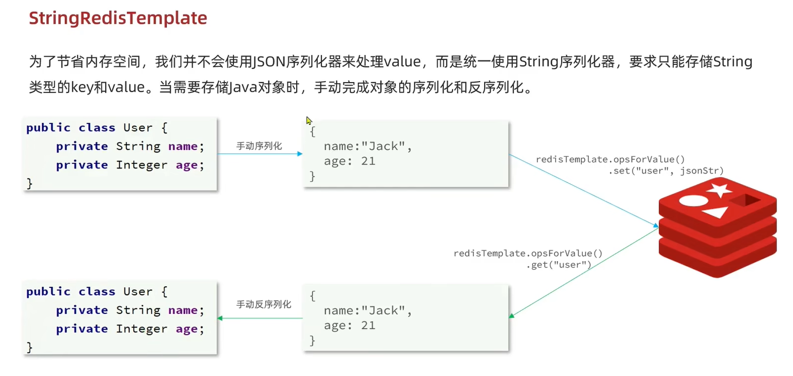
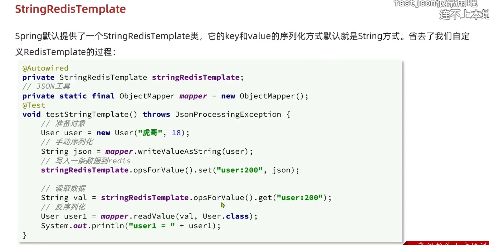

# 第一种 Redis Java 客户端 Jedis

# 第二种 Redis Java 客户端 SpringDataRedis

## 第一步 引入依赖
```xml
<dependency>
    <groupId>org.springframework.boot</groupId>
    <artifactId>spring-boot-starter-data-redis</artifactId>
</dependency>

<dependency>
    <groupId>org.apache.commons</groupId>
    <artifactId>commons-pool2</artifactId>
</dependency>
```
## 第二步 配置 yaml 文件
```xml
spring:
  data:
    redis:
      host: 127.0.0.1
      port: 6379
      lettuce:
        pool:
          max-active: 8 # 最大链接
          max-idle:   8 # 最大空闲连接
          min-idle:   0 # 最小空闲进程
          max-wait: 100 # 连接等待时间
```

# 序列化器
默认的序列化器会导致错误，因为 set 函数的掺入参数为 Object 而不是 String
因此

```java
@SpringBootTest
class Redis2DemoApplicationTests {

    @Autowired
    private RedisTemplate redisTemplate = new RedisTemplate();

    @Test
    void testString() {
        // 添加
        redisTemplate.opsForValue().set("name", "Jack");
        // 查询
        Object name = redisTemplate.opsForValue().get("name");
        // 打印查看
        System.out.println("name = " + name);
    }

}
```
# 使用 StringRedis 序列化器



# 手动编写 序列化 和 反序列化

想要插入自定义对象   手动编写 序列化 和 反序列化
